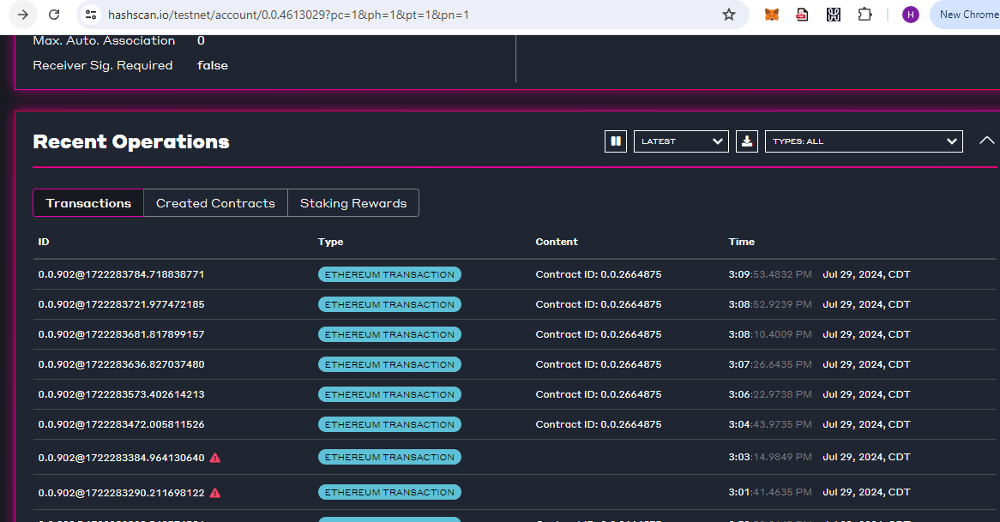
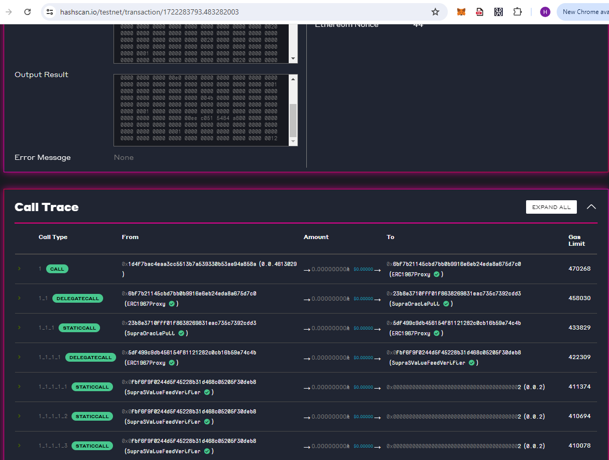

89 | 

```
Pair index :  [ '89' ]
Pair Price :  [ '100000000' ]        
Pair Decimal :  [ '8' ]
Pair Timestamp :  [ '1722283482100' ]
```

425:SAUCE_wHBAR

```
Pair index :  [ '425' ]
Pair Price :  [ '811548029439790850' ]
Pair Decimal :  [ '18' ]
Pair Timestamp :  [ '1722275643228' ] 
```

426: xSAUCE_wHBAR

```
Pair index :  [ '426' ]
Pair Price :  [ '932493611140730050' ]
Pair Decimal :  [ '18' ]
Pair Timestamp :  [ '1722275643228' ]
```


427: HBARX_wHBAR

```
Pair index :  [ '427' ]
Pair Price :  [ '1284867861056999850' ]
Pair Decimal :  [ '18' ]
Pair Timestamp :  [ '1722275643228' ]
```

432: HBAR_USD

```
Pair index :  [ '432' ]
Pair Price :  [ '67220000000000000' ]
Pair Decimal :  [ '18' ]
Pair Timestamp :  [ '1722283730049' ]
```

75: HBAR_USDT

```
Pair index :  [ '75' ]
Pair Price :  [ '67202500000000000' ]
Pair Decimal :  [ '18' ]
Pair Timestamp :  [ '1722283791100' ]
```


Proof for transactions to work:

transactions on my wallet for the RESTAPI calls
https://hashscan.io/testnet/account/0.0.4613029?pc=1&ph=1&pt=1&pn=1




Call Trace:

https://hashscan.io/testnet/transaction/1722283793.483282003




```Pair index :  [ '89' ]
Pair Price :  [ '100000000' ]
Pair Decimal :  [ '8' ]
Pair Timestamp :  [ '1722282833048' ]
Pair index :  [ '89' ]
Pair Price :  [ '100000000' ]
Pair Decimal :  [ '8' ]
Pair Timestamp :  [ '1722282833048' ]
Pair Decimal :  [ '8' ]
Pair Timestamp :  [ '1722282833048' ]
Transaction receipt: {
  blockHash: '0x8c1785c237421bde46a98c876d46ca10313eb000743ad09d903d54a755ec1685',
  blockNumber: 7187894n,
  from: '0x1d4f7bac4eaa3cc5513b7a539330b53ae94a858a',
  to: '0x6bf7b21145cbd7bb0b9916e6eb24eda8a675d7c0',
  cumulativeGasUsed: 400000n,
  gasUsed: 400000n,
  contractAddress: '0x6bf7b21145cbd7bb0b9916e6eb24eda8a675d7c0',
  logs: [
    {
      address: '0x6bf7b21145cbd7bb0b9916e6eb24eda8a675d7c0',
      blockHash: '0x8c1785c237421bde46a98c876d46ca10313eb000743ad09d903d54a755ec1685',
      blockNumber: 7187894n,
      data: '0x000000000000000000000000000000000000000000000000000000000000006000000000000000000000000000000000000000000000000000000000000000a000000000000000000000000000000000000000000000000000000000000000e00000000000000000000000000000000000000000000000000000000000000001000000000000000000000000000000000000000000000000000000000000005900000000000000000000000000000000000000000000000000000000000000010000000000000000000000000000000000000000000000000000000005f5e10000000000000000000000000000000000000000000000000000000000000000010000000000000000000000000000000000000000000000000000000000000001',
      logIndex: 0n,
      removed: false,
      topics: [Array],
      transactionHash: '0x7d69afb4b98d8c56a1f0e3ce882774d8f3c3b9152ae57afe35e7691273cdf583',
      transactionIndex: 1n
    }
  ],
  logsBloom: '0x00000000000000000000000000000000000000000000000000000000000000000000000000000000000000000000000100000000000000000000000002000000000000000000000000000000000000000000000000000000000000000000000000000000000000000000000000000000000000000000000000000000000000000000000020400000200000000000000000000000000000000000000000000000000000000000000000000000000000000000000000000400000000000000000000000000000000000000000000000000000000000000000000000000000000000000000000000000000000000000000000000000000000000000000000000000',
  transactionHash: '0x7d69afb4b98d8c56a1f0e3ce882774d8f3c3b9152ae57afe35e7691273cdf583',
  transactionIndex: 1n,
  effectiveGasPrice: 1270000000000n,
  status: 1n,
  type: 0n
}
PS C:\source\repos\harish_oracle-pull-example\rest\javascript\evm_client>````

